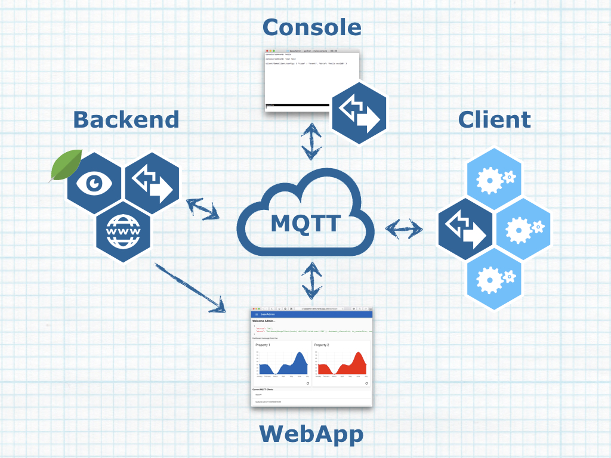

# baseAdmin

A framework for managing distributed (IoT) applications, providing configuration distribution along with a web-based UI and REST backend interface.

## Work in Progress Warning ;-)

I've only just started working on this and I'm literally exploring my own code as I write it ;-) So until this warning is removed, I wouldn't trust myself using this ;-) Do play with it, but remember things can and will change overnight.

## Rationale

Having developed several (IoT) solutions that included an administrative backend, common patterns emerged. With baseAdmin I'm extracting the common parts into a framework that can be forked and extended for specific applications. The main goal is a have a working solution out of the box that can be extended with minimal (redundant) effort.

## Philosophy

The main goal of baseAdmin is out of the box functionality that is extendable with minimal effort. Therefore it is highly driven by conventions. Trying to break away from these conventions will result in pain. If you feel that any of the conventions don't fit your needs, you better don't use baseAdmin.

## What's in the Box?



The minimal infrastructure you need is an `MQTT server`. Now you are ready to launch a `client` and have it join the MQTT network. Given some MQTT client, you can now publish configuration updates to the `client`.

Although a generic MQTT client is all you really need, having a `console` application supporting the protocol, might come in handy.

Because clients are sometimes offline, a `backend` offers additional services, such as configuration/logging consolidation & caching and a web/REST interface to consult this data from the `clients`.

## Technology Stack

This project stands on the shoulders of these wonderful high-power projects:

* Backend
  * [Python](https://www.python.org)
  * [Flask](http://flask.pocoo.org)
  * [Flask_Restful](http://flask-restful.readthedocs.io/en/latest/)
  * [Mongo DB](https://www.mongodb.com)
  * [MQTT](http://mqtt.org) e.g. [Eclipse Mosquitto](https://mosquitto.org)
* Frontend
  * [Vue.js](https://vuejs.org)
  * [Vuex](https://vuex.vuejs.org)
  * [Vuetify](https://vuetifyjs.com)
  * [Vue ChartJS](http://vue-chartjs.org)
  * [Paho Javascript Client](https://eclipse.org/paho/clients/js/)

## How to Use baseAdmin

Note: You can deploy this very easily on some Unix-based host. For some time now, I'm pretty happy with Heroku and given its generous free accounts, I'd advise you to try running your copy of baseAdmin there:

1. Fork this repository
2. (optional, but likely) Rename your repository
3. Deploy your fork to Heroku  
[](https://heroku.com/deploy)  
You now have your very own working baseAdmin installation, running the demo application. The latest version of this repository is continuously deployed to [https://baseadmin-demo.herokuapp.com](https://baseadmin-demo.herokuapp.com).
4. Clone your fork and start implementing your own application on top of baseAdmin.
5. (optional, but advised) Add the initial baseAdmin repository as an upstream remote:  
`git remote add upstream https://github.com/christophevg/baseAdmin`
6. Update your baseAdmin framework:  
`git fetch upstream; git checkout master; git merge upstream/master`  
(Hint: The top-level `Makefile` contains a target to do this: `make update`)

## Running baseAdmin Locally

Install dependencies: MongoDB and Mosquitto. Make sure Mosquitto is compiled with websockets support and enable a listener for it in the configuration file:

```
listener 1883

listener 9001 127.0.0.1
protocol websockets
```

The first time only: create a virtual Python environment:

```bash
$ virtualenv venv
```

From then on, activate the virtual environment, update it and run your backend:

```bash
$ . venv/bin/activate
(venv) $ pip install -r requirements.txt
(venv) $ python run.py
```
(Hint: The top-level `Makefile` contains a target to do this: `make run`)

### Provisioning of data

When run for the first time, the Mongo database will be populated with collections with data. When a collection already exists, it will not be touched.

### Environment

To set environment variables, a `env.local` file can be created alongside `run.py`. (Hint: it's already in the `.gitignore` file)

The defaults for local development are:

```
APP_NAME=baseAdmin
MONGODB_URI=mongodb://localhost:27017/baseAdmin
CLOUDMQTT_URL=ws://localhost:9001/
```

When the environment contains a variable `PROVISION`, the mongo database will be reinitialised; collections are dropped and recreated. This is a useful thing while developing baseAdmin or your own application.

(Hint: The top-level `Makefile` contains a target to do this: `make devel`)

### Testing

Visit `http://localhost:5000/dashboard`. From a command prompt issue:

```bash
$  mosquitto_pub -h localhost -t "prop1" -m "updateProperty"
```

and watch the left/blue graph.

## Configuration and its Protocol

Clients handle MQTT messages containing events representing configuration updates. Updates can be at the level of the client itself, or at the level of the services that are configured on the client. The following JSON example shows a complete client configuration of a client with two services configured, each with a configuration of their own:

```json
{
	"last-message" : "f50ec0b7-f960-400d-91f0-c42a6d44e3d0",
	"services" : {
		"service-1" : {
			"location": "http://localhost:21212/config",
			"config" : {
				"variable-1" : "value 1",
				"variable-2" : 123
			}
		},
		"service-2" : {
			"location": "http://localhost:31313/parameters",
			"config" : {
				"x" : 3.14,
				"y" : "hello world",
				"z" : [ 1, 2, 3 ]
			}			
		}
	}
}
```

A client configuration is uniquely identified by the unique identification of the last message that has been received and merged into the configuration (`last-message`). The configuration provides information about `services` for which the client is handling messages coming through the MQTT network. This services information consists of an object with a key/value pair for each service. The key represents the name of a service while the value contains a `location` and a `config`. `Location` is an URL to which the client will post configuration updates that target the service. `Config` contains an object that represents the consolidated configuration for that service.

> Technical side note: the unique identification of a message and client configuration is generated using python's `uuid.uuid1()`, which incorporates '_a host ID, sequence number, and the current time_'.

Two types of messages can be sent to the client. One to manage the services themselves and one to manage the services' configuration.

### Configuring Services

Given a client called "node-123", with a existing configuration as show above, the following example JSON message can be sent to `client/node-123/services`:

```json
{
	"uuid": "3a0749de-5421-11e8-9660-c82a14062914",
	"service": "another-service",
	"location": "http://localhost:41414/arguments"
}
```

This message would add a third service, called `another-service` and accessible at `http://localhost:41414/arguments` to the configuration of the client. The configuration's `last-message` would also be updated to the new unique identification `uuid` provided in this message.

> Service messages targeting the same service name, will update that service. When no `location` is provided, the service is removed.

### Service Configuration

The following example JSON message can be sent to `client/node-123/service/service-1`:

```json
{
	"uuid": "5f8949ab-5421-11e8-90eb-c82a14062914",
	"config" : {
		"variable-2" : 456
	}
}
```

This would update the value of `variable-2` in the configuration of `service-1`.

After these two messages, the entire configuration would look like this...

```json
{
	"last-message" : "5f8949ab-5421-11e8-90eb-c82a14062914",
	"services" : {
		"service-1" : {
			"location": "http://localhost:21212/config",
			"config" : {
				"variable-1" : "value 1",
				"variable-2" : 456
			}
		},
		"service-2" : {
			"location": "http://localhost:31313/parameters",
			"config" : {
				"x" : 3.14,
				"y" : "hello world",
				"z" : [ 1, 2, 3 ]
			}			
		},
		"another-service" : {
			"location" : "http://localhost:41414/arguments"
		}
	}
}
```

... and `Service-1` would also have received an update of its configuration through a POST to `http://localhost:21212/config` with a message body containing its updated configuration :

```json
{
	"variable-1" : "value 1",
	"variable-2" : 456
}
```

### Delayed Service Configuration Updates

When sending the following example JSON message to `client/node-123/service/service-1`:

```json
{
	"uuid": "e273f6eb-5428-11e8-bd5e-c82a14062914",
	"valid-from": "Fri May 11 10:12:52 2018", 
	"config" : {
		"variable-2" : 789
	}
}
```

`Service-1`'s configuration will not be updated immediately. In stead, the `client` saves this update to its `scheduled` tasks. The configuration will now look like this:

```json
{
	"last-message" : "e273f6eb-5428-11e8-bd5e-c82a14062914",
	"scheduled": [
		{
       	"schedule": "Fri May 11 10:12:52 2018",
      		"service": "service-1",
      		"update": {
        		"variable-2": 789
      		}
    	}
  	],
  	"services" : {
		"service-1" : {
			"location": "http://localhost:21212/config",
			"config" : {
				"variable-1" : "value 1",
				"variable-2" : 456
			}
		},
		"service-2" : {
			"location": "http://localhost:31313/parameters",
			"config" : {
				"x" : 3.14,
				"y" : "hello world",
				"z" : [ 1, 2, 3 ]
			}			
		},
		"another-service" : {
			"location" : "http://localhost:41414/arguments"
		}
	}
}
```

`Client` will check its scheduled tasks regularly (currently with 0.05s intervals) and apply any scheduled updates when their time has come.

> To check the current configuration of `Client`, you can dump its persisted copy using `bin/show_config.py`:
>
```bash
$ ./bin/show_config.py 
{u'checksum': u'7a5dcc8464d9fd34a08efad97853d55f',
 u'last-message': u'5',
 u'scheduled': [{u'schedule': datetime.datetime(2018, 5, 11, 10, 12, 52),
                 u'service': u'SomeService',
                 u'update': {u'x': 1}},
                {u'schedule': datetime.datetime(2018, 5, 11, 12, 15),
                 u'service': u'SomeService',
                 u'update': {u'x': 1}}],
 u'services': {u'SomeService': {u'config': {u'x': 1},
                                u'location': u'http://localhost:21212/config'}}}
```


## Try it

For a minimal demonstration, start the client:

```bash
$ . venv/bin/activate
(venv) $ pip install -r requirements.txt
...
(venv) $ python client.py
2018-05-06 21:10:03,623 [INFO ] loading local environment configuration from env.local
2018-05-06 21:10:03,861 [INFO ] loaded persisted configuration: {'ts': 1525633128.008239}
2018-05-06 21:10:03,861 [DEBUG] connecting to MQ localhost:1883
2018-05-06 21:10:03,866 [DEBUG] connected with result code 0
2018-05-06 21:10:03,866 [DEBUG] following client/client/services
```

(or use the Makefile: `make client`)

Now start another service that we will manage through the `client`:

```bash
$ . venv/bin/activate
(venv) $ pip install -r requirements.txt
...
(venv) $ python client_service.py
2018-05-06 21:10:24,823 [INFO ] loading local environment configuration from env.local
2018-05-06 21:10:24,842 [INFO ] loaded config on boot: None
```

The client now has also produced some new logging:

```bash
2018-05-06 21:10:24,840 [ERROR] failed to provide configuration : 'services'
```

The service isn't known to the client, in fact it doesn't know any services. Let's introduce it to the service:

```bash
$ mosquitto_pub -h localhost -t "client/client/services" -m '{ "service" : "SomeService", "location" : "http://localhost:21212/config"  }'
```

And the client responds with more logging:

```bash
2018-05-06 21:12:10,593 [INFO ] received message: client/client/services : { "service" : "SomeService", "location" : "http://localhost:21212/config"  }
2018-05-06 21:12:10,598 [INFO ] persisted updated configuration
2018-05-06 21:12:10,599 [DEBUG] {'ts': 1525633930.594219, 'services': {'SomeService': {'location': 'http://localhost:21212/config'}}, 'checksum': '4aef84e7e350a8633e5e8012711ac986'}
2018-05-06 21:12:10,599 [DEBUG] following client/client/services
2018-05-06 21:12:10,599 [DEBUG] following client/client/service/SomeService
```

So now, it knows about `SomeService` and it now also follows MQTT for configuration updates for `SomeService`. Let's give it such an update:

```bash
$ mosquitto_pub -h localhost -t "client/client/service/SomeService" -m '{ "config" : { "x" : 1 } }'
```

This message is received by the `client`:

```bash
2018-05-06 21:13:41,734 [INFO ] received message: client/client/service/SomeService : { "config" : { "x" : 1 } }
```

... and dispatched to `SomeService`:

```bash
2018-05-06 21:13:41,751 [INFO ] received config update : b'{"x": 1}'
```
