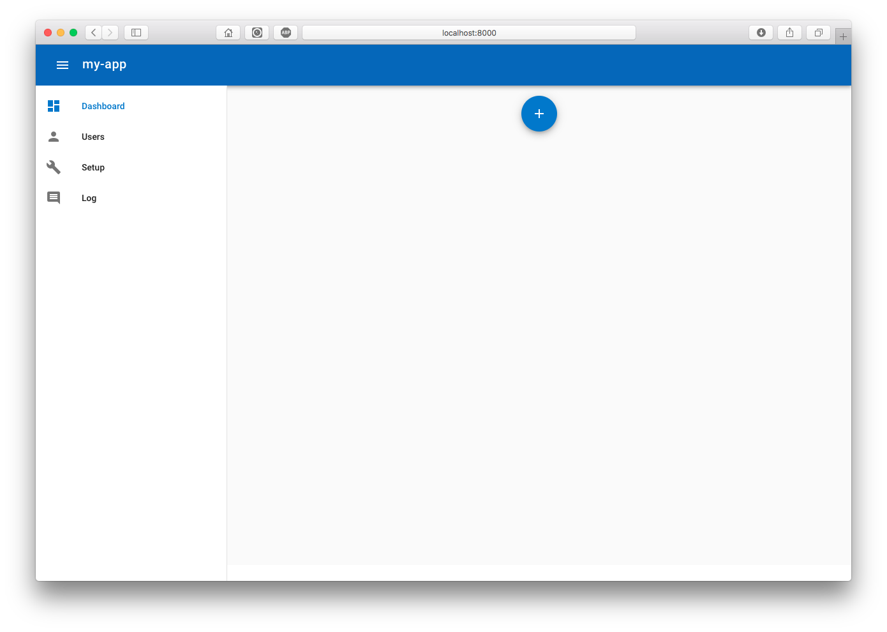

# Getting Started

baseAdmin allows you to create distributed applications and administrative interfaces to manage them. Several application topologies are possible, from a single node to a hierarchy with public and private nodes.

The following paragraphs introduce baseAdmin's ready-to-run functionality on your local host, introducing the different components and their relationships and possibilities to extend the out-of-the-box experience to your application.

> *Prerequisites to get started*: Install an MQTT server, e.g. Mosquitto, and MongoDB.

## Meet the baseAdmin backend

Open a shell and ...

```bash
$ mkdir my-app
$ cd my-app
$ virtualenv venv
$ . venv/bin/activate
(venv) $ pip install baseadmin
(venv) $ gunicorn baseadmin.backend.web:server
[2018-12-30 15:17:03 +0100] [45406] [INFO] Starting gunicorn 19.9.0
[2018-12-30 15:17:03 +0100] [45406] [INFO] Listening at: http://127.0.0.1:8000 (45406)
[2018-12-30 15:17:03 +0100] [45406] [INFO] Using worker: sync
[2018-12-30 15:17:03 +0100] [45409] [INFO] Booting worker with pid: 45409
[2018-12-30 15:17:03 +0100] [45409] [DEBUG] baseAdmin config = {'description': 'A baseAdmin app', 'author': 'Unknown Author', 'admin': {'pass': 'admin'}, 'register': {'user': 'client', 'pass': 'client'}, 'root': '/Users/xtof/Workspace/my-app', 'store': {'timeout': 1000, 'uri': 'mongodb://localhost:27017/my-app', 'cloud': False}, 'name': 'my-app'}
[2018-12-30 15:17:03 +0100] [45409] [DEBUG] connecting to mongodb://localhost:27017/my-app
[2018-12-30 15:17:04 +0100] [45409] [INFO] provisioning users
[2018-12-30 15:17:04 +0100] [45409] [INFO] provisioning collection: users
[2018-12-30 15:17:04 +0100] [45409] [INFO] provisioning pki
[2018-12-30 15:17:04 +0100] [45409] [INFO] provisioning collection: pki
[2018-12-30 15:17:04 +0100] [45409] [INFO] baseAdmin backend web server is ready. awaiting clients...
```

Now visit [http://127.0.0.1:8000](http://127.0.0.1:8000)... and meet the backend of your first baseAdmin application:



So what just happend? You created an application (`mkdir my-app`) and started it using the standard baseAdmin backend server (`gunicorn baseadmin.backend.web:server`). The server connects to both the MongoDB and MQTT server, and awaits your commands.

So given an empty application folder, baseAdmin already provides a lot out of the box: user management, global setup and logging facilities. You can click around, but little exciting is to be discovered at this time. To see some action, we need a ... client.

## Meet the baseAdmin client

The baseAdmin backend is the point where you will manage nodes in your distributed application. To link these nodes to the backend, we will create a client for the baseAdmin backend.

So meanwhile in another shell...

```bash
$ cd my-app
$ . venv/bin/activate
(venv) $ python
```
